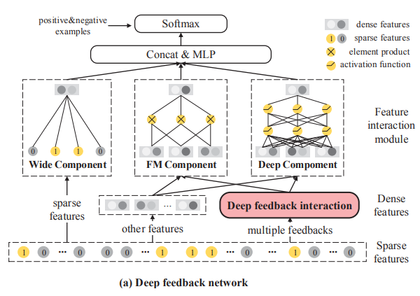
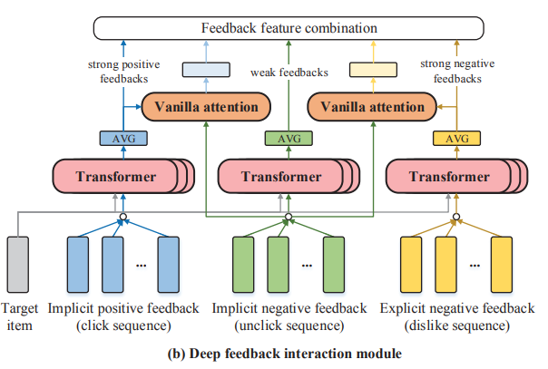

# Deep feedback network for recommendation
R Xie, C Ling, Y Wang, R Wang, F Xia, L Lin 

WeChat Search Application Department, Tencent

IJCAI, 2020, Cited by 10

https://www.ijcai.org/Proceedings/2020/0349.pdf

https://github.com/qqxiaochongqq/DFN

微信TopStory。

method:

- history data: 
    
    - Implicit positive feedbacks (click sequence).  
    - Explicit negative feedbacks (dislike sequence). 
    - Implicit negative feedbacks (impressed but unclick sequence).  vast, noises and false-negative signals.
    
        DFN : use high-quality click and dislike behaviors as instructors to extract useful information from unclick behaviors.

- model architecture:

    
    - [1] DFI. deep feedback ineraction module. (Take multiple feedbacks as inputs to exract user unbiased positive and negative preferences, with the help of internal and external feedback interactions)
        
    - [2] FA. Feature Aggregation by Wide/FM/Deep components. (Refined feedback features are combined with other informatie features such as user profiles, item features and recommendation contexts).
    - [3] FC. Fully connection + Softmax. (The outputs of feature interaction module are fed into fully connected and softmax layer for model optimization with both positive and negative losses).

- DFI: interactions between target item and individual behaviors. 2parts: internal feedback interaction, external feedback interaction.
    - Internal feedback interaction: [capture behavior level interactions between target item and behaviors]
        - inputs: all behavior features = item embeddings + position embeddings. 
        - transformer - average pooling  ---> get fc，fd,fu
            
    - External feedback interaction: [aims to distingush what users really like and dislike in unclick behaviors, according to strong feedbacks in click and dislike behaviors]
        
        - two vanilla attentions to get fuc and fud from unclick sequence, [considers implicit positive and explicit negative feedback embeddings fc and fd as instructors to guild positive and negative preference extractions from unclick sequences]

- FA: using Wide,FM, and Deep components for feature interaction

    - wide: linear. (input sparse)
    - FM: Bi-interaction layer. (all dense features and refined feedback features.) (second order feature interactions)
    - Deep:2layer MLP. (dense features, feedback features) (high-order feature interactions)
- Optimization Objective

    - utilize click,unclick, dislike.
    - $$\lambda_c * Pclick + \lambda_u * (1-unclick) + \lambda_d * (1-dislike)$$

- metric:
    - AUC
    - RelaImpr = (AUC_measured -0.5)/(AUC_base-0.5) - 1.

# Coupledcf: Learning explicit and implicit user-item couplings in recommendation for deep collaborative filtering
Zhang,Q  Cao,L  Zhu,C  Li, Z  Sun, J

IJCAI, 2018, Cited by 32

https://www.ijcai.org/Proceedings/2018/0509.pdf

# Explicit or Implicit Feedback? Engagement or Satisfaction?
Qian Zhao, F. Maxwell Harper, Gediminas Adomavicius, Joseph A. Konstan

University of Minnesota

DLACM, 2018, Cited by 23

https://dl.acm.org/doi/pdf/10.1145/3167132.3167275

# Fast Matrix Factorization for Online Recommendation with Implicit Feedback

Xiangnan He Hanwang Zhang Min-Yen Kan Tat-Seng Chua

School of Computing, National University of Singapore

ACM SIGIR, 2016, Cited by 640

http://staff.ustc.edu.cn/~hexn/papers/sigir16-eals-cm.pdf

# Rank and Rate: Multi-task Learning for Recommender Systems

Guy Hadash∗1, Oren Sar Shalom∗2, Rita Osadchy∗3

IBM Research, Haifa, Israel

ACM, 2018, Cited by 13

https://arxiv.org/pdf/1807.11698.pdf

# Recommendations with Negative Feedback via Pairwise Deep Reinforcement Learning
Xiangyu Zhao,Data Science and Engineering Lab
Michigan State University
Liang Zhang,Data Science Lab
Intelligent Advertising Lab JD.com

DLACM,2018,Cited by 131

https://export.arxiv.org/pdf/1802.06501

# Modeling dynamic missingness of implicit feedback for recommendation
Menghan Wang, College of Computer Science,Zhejiang University;
Mingming Gong, Department of Biomedical Informatics,University of Pittsburgh; Xiaolin Zheng∗,College of Computer Science,Zhejiang University;Kun Zhang,Department of Philosophy,Carnegie Mellon University kunz1@cmu.edu

Cited by 25

https://papers.nips.cc/paper/2018/file/8d9766a69b764fefc12f56739424d136-Paper.pdf
